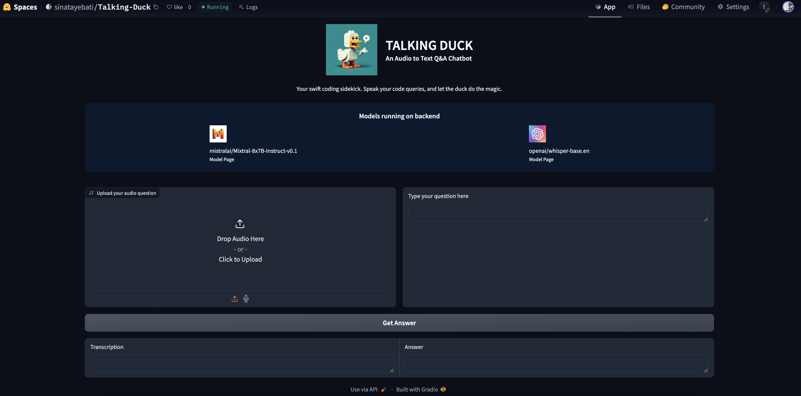

# TALKING DUCK 🦆

Dive into the code with [**TALKING DUCK**](https://huggingface.co/spaces/sinatayebati/Talking-Duck)! More than just a duck, it's the code buddy you wished for—one that talks back, navigates through your code woes, and never just stares blankly. 

Ready for a quack-tastic coding session? Join the party at its [Hugging Face Space](https://huggingface.co/spaces/sinatayebati/Talking-Duck) 🎉


<p align="center">
    
</p>


## What's the Quack?

**TALKING DUCK** is an LLM-powered chatbot that does more than just float around. It listens (literally) to your code problems, thanks to its audio-to-text superpower, and then it gets its webbed feet dirty by diving into the depths of code logic to bring you pearls of wisdom... or at least, the answers to your coding questions.

Whether you're tangled in the vines of Python, lost in the braces of JavaScript, or just need someone to tell you "It's gonna be okay, buddy," **TALKING DUCK** is your go-to aquatic ally.

## What's the Quack?

**TALKING DUCK** is an LLM-powered coding companion ready to tackle your code conundrums. With its audio-to-text superpower, it listens to your woes and dives deep to fetch solutions—or at least tries to. Python puzzles? JavaScript jumbles? Need a virtual "there, there"? **TALKING DUCK** is your feathered fixer-upper. 🦆💻


## Features

- 🎤 **Audio Input**: Speak up, and thanks to `openai/whisper-base`, your words turn into queries.
- 🤔 **Brainy Insights**: Leveraging LLM model `mistralai/Mistral-8x7B-Instruct-v0.1`, it's like having a genius duck decode your code.
- 💡 **Insightful Answers**: From smart solutions to a chuckle-worthy quack, get the guidance you need.
- 🦆 **Fun Interface**: Who says problem-solving can't be fun? Dive into a duck-themed coding adventure.


# Get Started
To build Talking Duck, you could build from docker or setup a conda environment.


## Docker Setup

If you prefer to keep your machine clean and run everything in containers, **TALKING DUCK** is Docker-ready! Just follow these simple steps to containerize the quack:

### Build the Docker Image

Navigate to the root directory of the cloned project where the `Dockerfile` is located, and run:

```bash
docker build -t talking-duck .
```

This command builds a Docker image named `talking-duck` based on the instructions in your `Dockerfile`.

### Run the Container

Once the build is complete, you can run **TALKING DUCK** in a Docker container using:

```bash
docker run -p 7860:7860 talking-duck
```

This command starts a container from the `talking-duck` image, mapping port 7860 of the container to port 7860 on your host machine. 

### Visit Your Duck

Open your favorite web browser and navigate to `http://localhost:7860` to interact with **TALKING DUCK**. No installation mess, just pure, unadulterated duck fun.

### Docker Compose (Optional)

For an even easier setup, if you have a `docker-compose.yml` file at the root of your project, you can start **TALKING DUCK** with just one command:

```bash
docker-compose up --build
```

This command uses Docker Compose to build the image and run the container as defined in your `docker-compose.yml` file. It's perfect for when you want to get up and running with minimal fuss.

---

**Note:** Be sure to adjust the `docker build` and `docker run` commands based on your specific Docker setup, including the correct image names and any additional options you might need. The instructions above assume a basic setup for demonstration purposes.

Don't forget to check the Docker and Docker Compose documentation for more detailed information on building and running containers.

## Env setup

Want your very own **TALKING DUCK**? Follow these steps to clone this repository and get quacking:


1. **Clone the Repository**

    ```bash
    git clone https://github.com/your-username/talking-duck.git
    cd talking-duck
    ```

2. **Set Up Your Pond**

    Make sure you have Python installed, then dive in with:

    ```bash
    pip install -r requirements.txt
    ```

3. **Wake the Duck**

    Start your **TALKING DUCK** with:

    ```bash
    python app.py
    ```

    Visit `http://localhost:7860` in your web browser to see **TALKING DUCK** in all its glory!


Sure! Here’s an addition to the README that includes instructions for building and running the **TALKING DUCK** project using Docker. This section assumes that you’ve Dockerized your Gradio app, as discussed earlier.

---


## Contribute

Got ideas to make **TALKING DUCK** even cooler? Fork this repo, make your changes, and submit a pull request. New jokes, features, and improvements are always welcome. Let's make coding fun together!

## License

**TALKING DUCK** is released under the MIT License. See `LICENSE` for more information.

---

Remember to replace `https://github.com/your-username/talking-duck.git` with the actual URL of your repository. Feel free to adjust the tone and content to match your project's personality and features more closely!